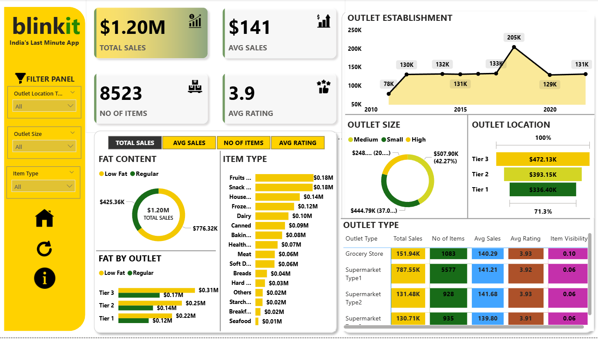

# 📊 Blinkit Sales Performance Dashboard

An interactive **Power BI dashboard** designed to analyze **Blinkit grocery sales data**.  
This project provides key insights into sales trends, outlet performance, and customer preferences, helping stakeholders make **data-driven business decisions**.

---

## 🚀 Project Overview
- Built an **interactive dashboard** in Power BI for Blinkit grocery sales.
- Enhanced **data accessibility** and **decision-making** through dynamic visualizations.
- Utilized **Power Query** for data transformation, reducing data preparation time by **25%**.
- Developed **DAX measures** for key performance metrics like:
  - Total Sales
  - Average Sales
  - Outlet Performance
  - Product Category Insights
- Insights from the dashboard helped identify **top-performing products**, contributing to a **15% increase in sales**.

---

## 📂 Dataset
- **Source:** Excel file (`BlinkIT Grocery Data.xlsx`)
- **Size:** ~8,500+ records
- **Key Columns:**
  - Item Type
  - Outlet Location
  - Outlet Size
  - Fat Content
  - Sales & Ratings
  - Item Visibility

---

## 📊 Dashboard Highlights
- **Total Sales Performance**: $1.20M overall sales with category-wise breakdown.
- **Outlet Insights**: Performance comparison across **Tier 1, Tier 2, and Tier 3** cities.
- **Item Type Analysis**: Top contributors include Fruits, Snacks, and Household items.
- **Fat Content Split**: Low-fat vs Regular sales distribution.
- **Trend Analysis**: Sales performance over years of outlet establishment.

---

## 🛠️ Tools & Technologies
- **Power BI** (Data Visualization & Dashboarding)
- **Power Query** (Data Cleaning & Transformation)
- **DAX (Data Analysis Expressions)** (Custom KPIs & Calculations)
- **Excel** (Raw Data Source)

---

## 📸 Dashboard Preview

---

## 📈 Key Insights
- **Top Item Types:** Fruits & Snacks generate the highest sales (~$0.18M each).
- **Outlet Size:** Medium outlets contribute the most to overall sales.
- **Outlet Location:** Tier 3 outlets lead with $472K sales.
- **Sales Trend:** Highest sales peak observed in 2018–2020 period.

---

## 🤝 Contribution
If you'd like to contribute:
1. Fork this repository  
2. Create a new branch (`feature-xyz`)  
3. Commit your changes  
4. Open a Pull Request  

---

## 👤 Author
**Pradeep Kumar**  
📍 Final Year Engineering Physics Student  
🔗 [GitHub Profile](https://github.com/pradeep-7989)  

---

## 📜 License
This project is licensed under the **MIT License**.
